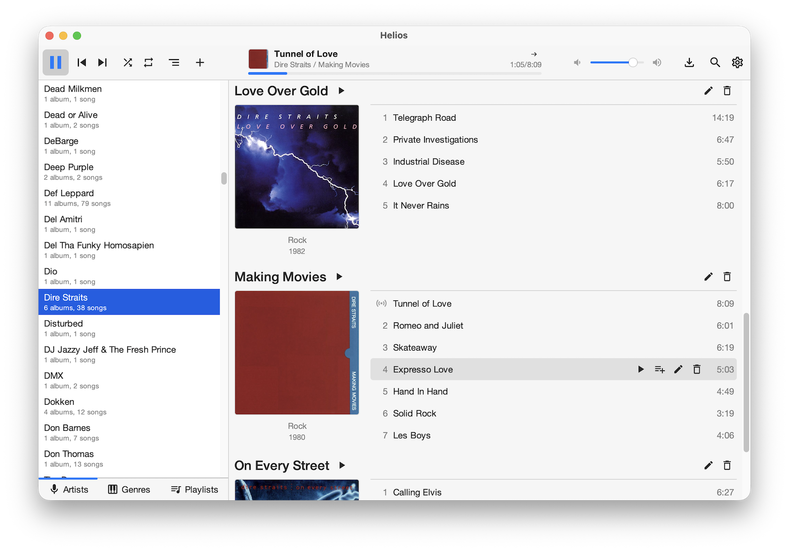

Helios is a cross-platform desktop application that makes it easy for you to enjoy and manage your local music library. It is currently available for macOS and Windows:

Helios supports the following keyboard shortcuts to help simplify library navigation:

* __Space bar__: Play or pause the current song.
* __Command-Left Arrow__: Rewind the current song.
* __Command-Right Arrow__: Fast-forward the current song.
* __Command-Shift Left Arrow__: Move to the previous song.
* __Command-Shift Right Arrow__: Move to the next song.
* __Command-S__: Toggle shuffle mode.
* __Command-R__: Toggle repeat mode.
* __Command-Q__: Show the music queue.
* __Command-N__: Add songs or create a playlist.
* __Command-G__: Go to the currently playing song.
* __Command-Down Arrow__: Decrease playback volume.
* __Command-Up Arrow__: Increase playback volume.
* __Command-D__: Download missing album artwork.
* __Command-F__: Search for songs.
* __Command-P__: View application settings.
* __Command-1__: Go to the Artists tab.
* __Command-2__: Go to the Genres tab.
* __Command-3__: Go to the Playlists tab.

Note that on Windows, the __Control__ key is used instead of __Command__.

If you like using Helios, please consider making a [donation](https://github.com/sponsors/gk-brown) to help support future maintenance and development.
